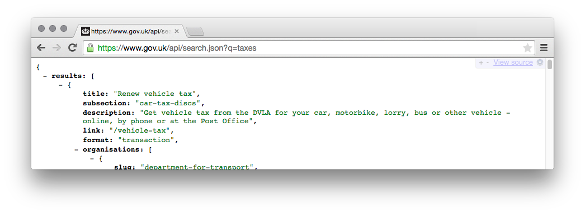

# Rummager

Rummager is the internal GOV.UK API for search.

## Live examples

- [alphagov/frontend](https://github.com/alphagov/frontend) uses Rummager to serve the GOV.UK search at [gov.uk/search](https://www.gov.uk/search).
- [alphagov/finder-frontend](https://github.com/alphagov/finder-frontend) uses Rummager to serve document finders like [gov.uk/aaib-reports](https://www.gov.uk/aaib-reports).

This API is publicly accessible:

https://www.gov.uk/api/search.json?q=taxes


## Technical documentation

This is a Sinatra application that provides an API for search to multiple applications. It isn't supposed to be used by regular users, but it is publicly available on [gov.uk/api/search.json](https://www.gov.uk/api/search.json?q=taxes).

### Dependencies

- [elasticsearch](https://github.com/elastic/elasticsearch) - "You Know, for Search...".
- [redis](https://github.com/redis/redis) - used by indexing workers.

### Setup

To create indices, or to update them to the latest index settings, run:

    RUMMAGER_INDEX=all bundle exec rake rummager:migrate_index

If you have indices from a Rummager instance before aliased indices, run:

    RUMMAGER_INDEX=all bundle exec rake rummager:migrate_from_unaliased_index

If you don't know which of these you need to run, try running the first one; it
will fail safely with an error if you have an unmigrated index.

## Indexing content

You will need Panopticon and Rummager running.

To build an index from scratch you will need to be in Publisher repo and run:

  bundle exec rake panopticon:register

This will loop through each published edition and create a RegisterableEdition which will call Panopticon to update it's artefact with.

Remember: the on save observer in panopticon is what fires off the submit to Elasticsearch.

By default, Panopticon will not try to index search content in development mode, so you'll need to have an extra environment variable to it.

  UPDATE_SEARCH=1

To add a new index to Rummager, you'll first need to add it to the list of index names Rummager knows about in [`elasticsearch.yml`](elasticsearch.yml). For instance, you might change it to:

    index_names: ["dapaas", "odi", "my_new_index"]

### Running the application

If you're running the GDS development VM:

    cd /var/govuk/development && bundle exec bowl rummager

If you're not running the GDS development VM:

    ./startup.sh

Rummager should then be available at [rummager.dev.gov.uk](http://rummager.dev.gov.uk/unified_search.json?q=taxes).

Rummager has an asynchronous mode, disabled in development by default, that
posts documents to a queue to be indexed later by a worker. To run this in
development, you need to run both of these commands:

ENABLE_QUEUE=1 ./startup.sh
bundle exec rake jobs:work

## Once ODI search is LIVE

The below Health check will need updating with relevant data for ODI and then you can have some "objective" metrics for search.

## Health check

### Running the test suite

    bundle exec rake

### Indexing & Reindexing

After changing the schema, you'll need to migrate the index.

    RUMMAGER_INDEX=all bundle exec rake rummager:migrate_index

### Example API output

The simplest query:

    curl 'http://rummager.dev.gov.uk/unified_search.json?q=taxes'

For the most up to date query syntax and API output, check the documentation for individual endpoints in [app.rb](app.rb).

```json
{  
   "results":[  
      {  
         "title":"Renew vehicle tax",
         "subsection":"car-tax-discs",
         "description":"Get vehicle tax from the DVLA for your car, motorbike, lorry, bus or other vehicle - online, by phone or at the Post Office",
         "link":"/vehicle-tax",
         "format":"transaction",
         "organisations":[  
            {  
               "slug":"department-for-transport",
               "link":"/government/organisations/department-for-transport",
               "title":"Department for Transport",
               "acronym":"DFT",
               "organisation_type":"Ministerial department",
               "organisation_state":"live"
            },
            {  
               "slug":"driver-and-vehicle-licensing-agency",
               "link":"/government/organisations/driver-and-vehicle-licensing-agency",
               "title":"Driver and Vehicle Licensing Agency",
               "acronym":"DVLA",
               "organisation_state":"live"
            }
         ],
         "public_timestamp":"2014-12-09T16:21:03+00:00",
         "section":"driving",
         "index":"mainstream",
         "es_score":0.29372323,
         "_id":"/vehicle-tax",
         "document_type":"edition"
      },
      { ... }
      ],
   "total":11876,
   "start":0,
   "facets":{  

   },
   "suggested_queries":[]
}
```


### Additional Docs

- [Health Check](docs/health-check.md): usage instructions for the Health Check functionality.
- [Popularity information](docs/popularity.md): Rummager uses Google Analytics data to improve search results.

## Licence

[MIT License](LICENCE.txt)
